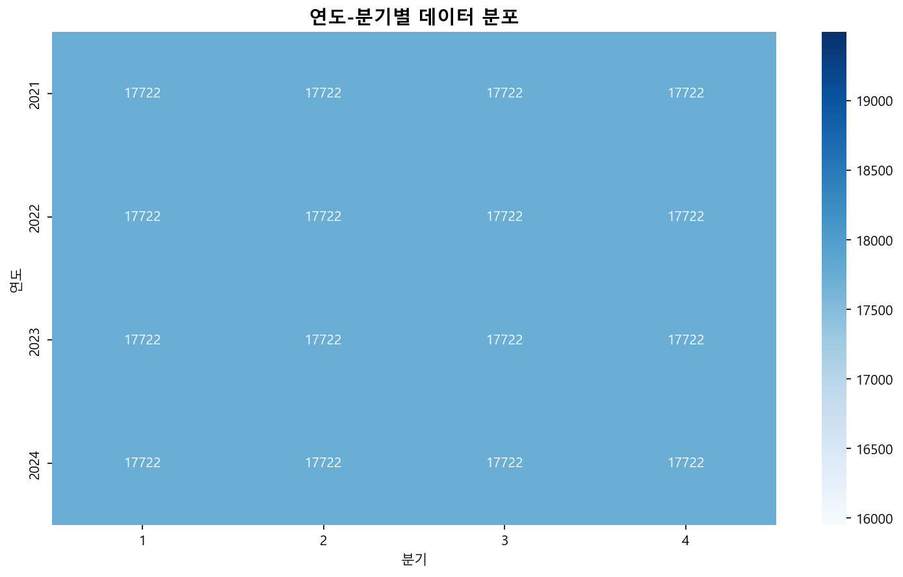
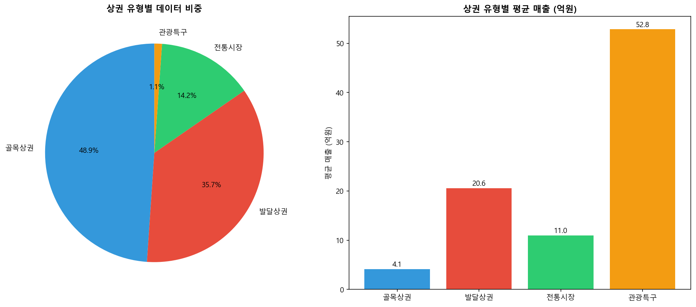
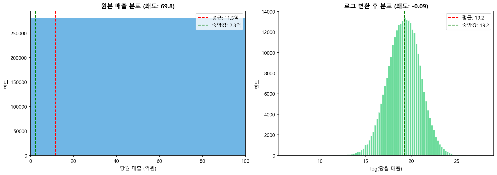
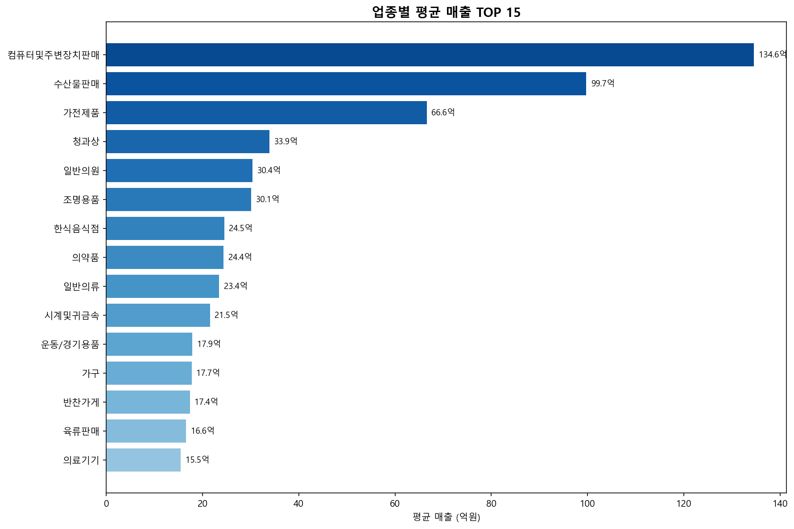
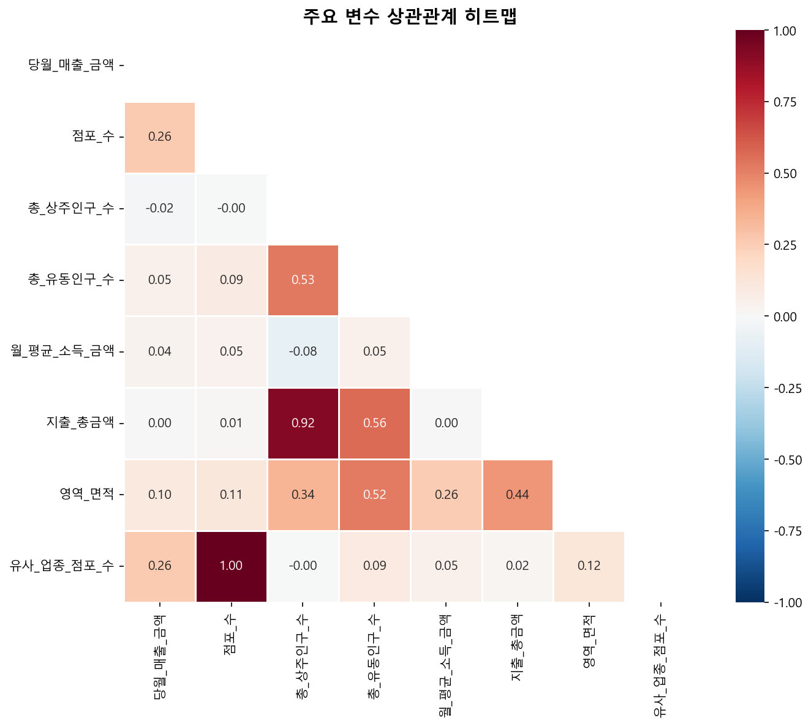
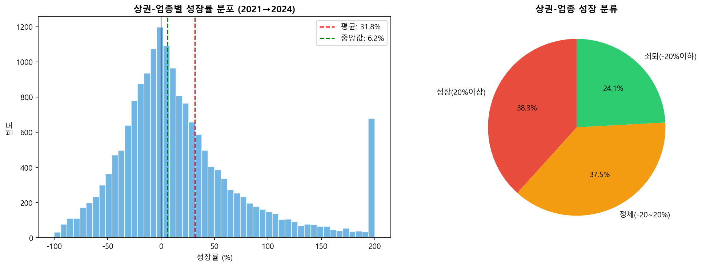
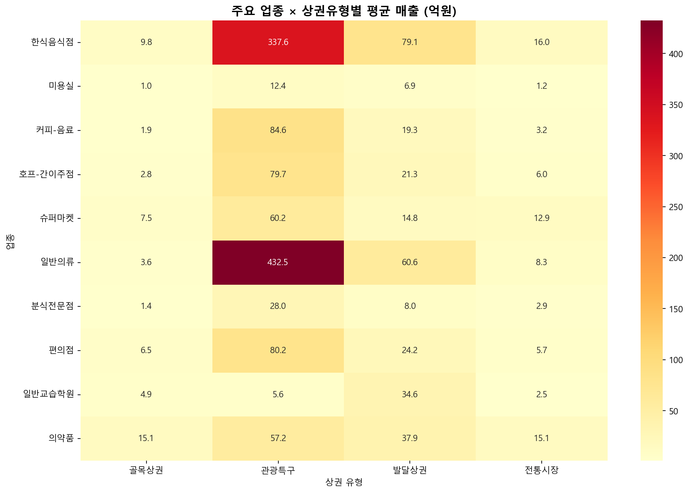
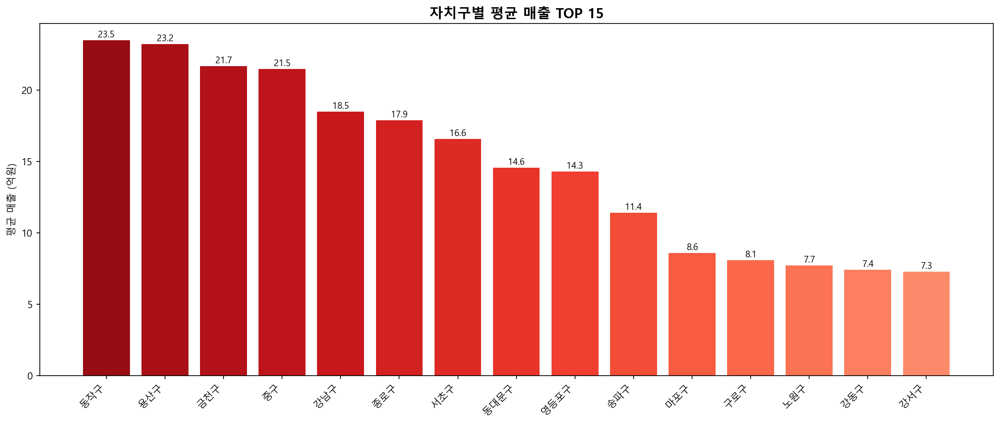
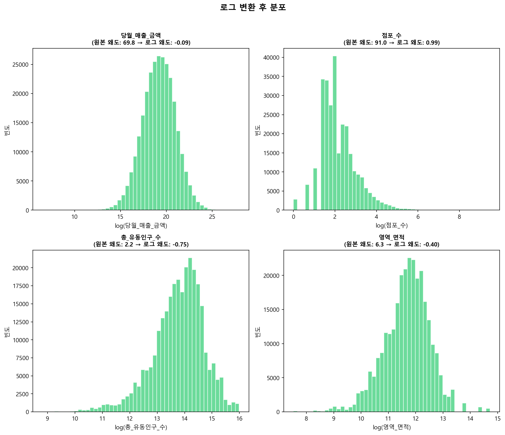

# 📊 서울시 상권 데이터 탐색적 데이터 분석 (EDA) 결과 보고서

## 개요

본 문서는 **AnalysisPlan.md** 작성을 위해 수행된 탐색적 데이터 분석(EDA)의 코드, 결과, 해석을 종합적으로 정리한 보고서입니다.

### 분석 데이터
- **파일명**: `4개년_통합데이터_추정매출_상주인구_소득소비_길단위인구_점포_영역.csv`
- **기간**: 2021년 ~ 2024년 (4개년, 16분기)
- **규모**: 283,552건 × 129개 컬럼

### 분석 목적
1. 데이터 구조 및 품질 파악
2. 주요 변수의 분포 특성 이해
3. 변수 간 관계 탐색
4. 모델링 전략 수립을 위한 인사이트 도출

---

## 1. 데이터 기본 구조

### 1.1 코드

```python
import pandas as pd
import numpy as np

# 데이터 로드
df = pd.read_csv('4개년_통합데이터_추정매출_상주인구_소득소비_길단위인구_점포_영역.csv', encoding='utf-8')

# 연도/분기 추출
df['기준_년_코드'] = df['기준_년분기_코드'] // 10
df['기준_분기_코드'] = df['기준_년분기_코드'] % 10

# 기본 정보 출력
print(f"총 데이터 수: {len(df):,}건")
print(f"컬럼 수: {df.shape[1]}개")
print(f"기간: {df['기준_년_코드'].min()}년 ~ {df['기준_년_코드'].max()}년")
print(f"고유 상권 수: {df['상권_코드'].nunique():,}개")
print(f"고유 업종 수: {df['서비스_업종_코드'].nunique()}개")
print(f"결측치: {df.isnull().sum().sum()}개")
```

### 1.2 결과

| 항목 | 값 |
|------|-----|
| **총 데이터 수** | 283,552건 |
| **컬럼 수** | 129개 |
| **기간** | 2021년 ~ 2024년 |
| **고유 상권 수** | 1,479개 |
| **고유 업종 수** | 62개 |
| **결측치** | 0개 |

### 1.3 해석

- **데이터 완결성**: 결측치가 전혀 없어 데이터 품질이 우수함
- **분석 단위**: 상권(1,479개) × 업종(62개) × 분기(16개) 조합
- **변수 풍부성**: 129개 변수로 다양한 관점의 분석 가능
- **시계열 분석 가능**: 4개년 16분기 데이터로 추세 분석 가능

---

## 2. 연도별/분기별 데이터 분포

### 2.1 코드

```python
# 연도-분기 조합별 데이터 수
yq_counts = df.groupby(['기준_년_코드', '기준_분기_코드']).size().unstack(fill_value=0)
print(yq_counts)
```

### 2.2 결과

| 연도 | 1분기 | 2분기 | 3분기 | 4분기 |
|:----:|------:|------:|------:|------:|
| 2021 | 17,722 | 17,722 | 17,722 | 17,722 |
| 2022 | 17,722 | 17,722 | 17,722 | 17,722 |
| 2023 | 17,722 | 17,722 | 17,722 | 17,722 |
| 2024 | 17,722 | 17,722 | 17,722 | 17,722 |

### 2.3 시각화



### 2.4 해석

- **완벽한 균형 데이터**: 모든 연도-분기 조합이 동일한 17,722건
- **패널 데이터 구조**: 동일한 상권-업종 조합이 시간에 따라 반복 측정됨
- **시계열 분석 적합**: 균형 잡힌 패널 데이터로 시계열 비교 분석에 최적

---

## 3. 상권 유형별 분포

### 3.1 코드

```python
# 상권 유형별 분포
area_dist = df['상권_구분_코드_명'].value_counts()
for name, count in area_dist.items():
    pct = count / len(df) * 100
    print(f"{name}: {count:,}건 ({pct:.1f}%)")

# 상권 유형별 평균 매출
area_sales = df.groupby('상권_구분_코드_명')['당월_매출_금액'].mean() / 1e8
```

### 3.2 결과

| 상권 유형 | 데이터 수 | 비중 | 평균 매출 |
|----------|----------:|-----:|----------:|
| **골목상권** | 138,704건 | 48.9% | 4.1억원 |
| **발달상권** | 101,280건 | 35.7% | 20.6억원 |
| **전통시장** | 40,384건 | 14.2% | 11.0억원 |
| **관광특구** | 3,184건 | 1.1% | 52.8억원 |

### 3.3 시각화



### 3.4 해석

- **골목상권 중심**: 전체 데이터의 약 절반(48.9%)이 골목상권
- **관광특구 고매출**: 데이터 비중은 1.1%에 불과하지만 평균 매출 52.8억원으로 압도적
- **상권 유형별 차이**: 골목상권(4.1억) vs 관광특구(52.8억) → **약 13배 차이**
- **분석 시사점**: 상권 유형을 더미변수로 모델에 반드시 포함해야 함

---

## 4. 매출 분포 분석

### 4.1 코드

```python
# 기술통계
sales_stats = df['당월_매출_금액'].describe()
print(f"평균: {sales_stats['mean']:,.0f}원")
print(f"중앙값: {sales_stats['50%']:,.0f}원")
print(f"왜도: {df['당월_매출_금액'].skew():.2f}")

# 로그 변환
log_sales = np.log1p(df['당월_매출_금액'])
print(f"로그 변환 후 왜도: {log_sales.skew():.2f}")
```

### 4.2 결과

| 통계량 | 원본 | 로그 변환 후 |
|--------|-----:|------------:|
| **평균** | 11.5억원 | 19.3 |
| **중앙값** | 2.3억원 | 19.2 |
| **표준편차** | 106억원 | 1.7 |
| **최소** | 686원 | 6.5 |
| **최대** | 1.37조원 | 27.9 |
| **왜도** | **69.84** | **-0.09** |

### 4.3 시각화



### 4.4 해석

- **극단적 오른쪽 편향**: 원본 왜도 69.84 → 극소수의 초고매출 상권이 평균을 크게 끌어올림
- **평균 vs 중앙값 괴리**: 평균(11.5억) vs 중앙값(2.3억) → **약 5배 차이**
- **로그 변환 효과**: 왜도 69.84 → -0.09로 **99.9% 개선** → 정규분포에 근접
- **전처리 전략**: 회귀 분석 시 **로그 변환 필수**

---

## 5. 연도별 매출 추세

### 5.1 코드

```python
# 연도별 평균 매출
yearly_sales = df.groupby('기준_년_코드')['당월_매출_금액'].agg(['mean', 'median']).reset_index()
yearly_sales.columns = ['연도', '평균매출', '중앙값매출']

# 성장률 계산
yearly_sales['성장률'] = yearly_sales['평균매출'].pct_change() * 100
```

### 5.2 결과

| 연도 | 평균 매출 | 전년 대비 성장률 |
|:----:|----------:|-----------------:|
| 2021 | 10.73억원 | - |
| 2022 | 11.37억원 | **+5.9%** |
| 2023 | 11.96억원 | **+5.2%** |
| 2024 | 12.07억원 | +0.9% |

### 5.3 시각화


### 5.4 해석

- **코로나 회복기 고성장**: 2021→2022년 +5.9%, 2022→2023년 +5.2%
- **2024년 성장 정체**: +0.9%로 성장세 둔화
- **전체 성장**: 2021년 대비 2024년 약 **12.5% 성장**
- **시계열 분석 시사점**: 코로나 전후 효과를 고려한 분석 필요

---

## 6. 업종별 매출 분석

### 6.1 코드

```python
# 업종별 평균 매출
service_sales = df.groupby('서비스_업종_코드_명')['당월_매출_금액'].mean().sort_values(ascending=False)

print("[고매출 업종 TOP 10]")
for i, (name, val) in enumerate(service_sales.head(10).items(), 1):
    print(f"{i:2d}. {name}: {val/1e8:.1f}억원")
```

### 6.2 결과

**고매출 업종 TOP 10**

| 순위 | 업종명 | 평균 매출 |
|:---:|--------|----------:|
| 1 | 컴퓨터및주변장치판매 | **134.6억원** |
| 2 | 수산물판매 | 99.7억원 |
| 3 | 가전제품 | 66.6억원 |
| 4 | 청과상 | 33.9억원 |
| 5 | 일반의원 | 30.4억원 |
| 6 | 조명용품 | 30.1억원 |
| 7 | 한식음식점 | 24.5억원 |
| 8 | 의약품 | 24.4억원 |
| 9 | 일반의류 | 23.4억원 |
| 10 | 시계및귀금속 | 21.5억원 |

**저매출 업종 TOP 5**

| 순위 | 업종명 | 평균 매출 |
|:---:|--------|----------:|
| 1 | 세탁소 | 0.63억원 |
| 2 | 네일숍 | 0.66억원 |
| 3 | 당구장 | 0.76억원 |
| 4 | 자동차미용 | 0.94억원 |
| 5 | 철물점 | 1.28억원 |

### 6.3 시각화



### 6.4 해석

- **업종별 매출 격차**: 최고(134.6억) vs 최저(0.63억) → **약 214배 차이**
- **고매출 업종 특성**: 도매성 업종(컴퓨터, 수산물, 가전)이 상위 차지
- **저매출 업종 특성**: 개인 서비스업(세탁소, 네일숍)이 하위 차지
- **분석 시사점**: 업종 코드를 더미변수로 반드시 포함, 또는 업종별 분리 분석 고려

---

## 7. 주요 변수 상관관계 분석

### 7.1 코드

```python
# 상관 변수 선정
corr_vars = ['당월_매출_금액', '점포_수', '총_상주인구_수', '총_유동인구_수', 
             '월_평균_소득_금액', '지출_총금액', '영역_면적', '유사_업종_점포_수']

# 상관 행렬 계산
corr_matrix = df[corr_vars].corr()

# 매출과의 상관계수
sales_corr = corr_matrix['당월_매출_금액'].sort_values(ascending=False)

# 높은 상관관계 쌍 탐색 (다중공선성)
for i in range(len(corr_vars)):
    for j in range(i+1, len(corr_vars)):
        if abs(corr_matrix.iloc[i, j]) > 0.7:
            print(f"{corr_vars[i]} ↔ {corr_vars[j]}: {corr_matrix.iloc[i, j]:.3f}")
```

### 7.2 결과

**당월_매출_금액과의 상관계수**

| 변수 | 상관계수 | 해석 |
|------|:--------:|------|
| 유사_업종_점포_수 | **+0.261** | 양의 상관 (가장 높음) |
| 점포_수 | **+0.258** | 양의 상관 |
| 영역_면적 | +0.101 | 약한 양의 상관 |
| 총_유동인구_수 | +0.051 | 매우 약한 양의 상관 |
| 월_평균_소득_금액 | +0.035 | 거의 무상관 |
| 지출_총금액 | +0.000 | 무상관 |
| 총_상주인구_수 | -0.016 | 거의 무상관 |

**높은 상관관계 쌍 (다중공선성 우려)**

| 변수 쌍 | 상관계수 | 조치 |
|---------|:--------:|------|
| 점포_수 ↔ 유사_업종_점포_수 | **0.999** | 하나만 선택 필요 |
| 총_상주인구_수 ↔ 지출_총금액 | **0.918** | 하나만 선택 필요 |

### 7.3 시각화



### 7.4 해석

- **점포 밀도 중요**: 점포_수, 유사_업종_점포_수가 매출과 가장 높은 상관
- **인구/소득 영향 미미**: 유동인구, 상주인구, 소득은 매출과 약한 상관
- **다중공선성 주의**: 
  - `점포_수`와 `유사_업종_점포_수`는 거의 동일한 정보 (r=0.999)
  - 회귀 모델에서 **둘 중 하나만 선택** 필요
- **비선형 관계 가능성**: 선형 상관이 낮지만 비선형 관계가 있을 수 있음

---

## 8. 상권 성장률 분석 (2021→2024)

### 8.1 코드

```python
# 상권-업종별 연도별 매출 집계
yearly_by_sangwon = df.groupby(['상권_코드', '서비스_업종_코드', '기준_년_코드'])['당월_매출_금액'].sum().reset_index()

# 2021년 vs 2024년 매출
sales_2021 = yearly_by_sangwon[yearly_by_sangwon['기준_년_코드'] == 2021]
sales_2024 = yearly_by_sangwon[yearly_by_sangwon['기준_년_코드'] == 2024]

# 성장률 계산
growth_df = pd.merge(sales_2021, sales_2024, on=['상권_코드', '서비스_업종_코드'])
growth_df['성장률'] = (growth_df['매출_2024'] - growth_df['매출_2021']) / growth_df['매출_2021'] * 100

# 성장 분류
growth_df['성장_분류'] = pd.cut(growth_df['성장률'], 
                              bins=[-np.inf, -20, 20, np.inf],
                              labels=['쇠퇴(-20%이하)', '정체(-20~20%)', '성장(20%이상)'])
```

### 8.2 결과

**상권-업종 조합 성장률 통계**

| 통계량 | 값 |
|--------|----:|
| 분석 대상 | 17,722개 |
| 평균 성장률 | **+31.8%** |
| 중앙값 성장률 | +6.2% |
| 표준편차 | 285.3% |

**성장 분류별 분포**

| 분류 | 수 | 비율 |
|------|----:|-----:|
| **성장 (20% 이상)** | 6,792개 | 38.3% |
| **정체 (-20~20%)** | 6,652개 | 37.5% |
| **쇠퇴 (-20% 이하)** | 4,278개 | 24.1% |

**상권 단위 성장 분류**

| 분류 | 상권 수 | 비율 |
|------|--------:|-----:|
| **성장 상권** | 739개 | 50.0% |
| **정체 상권** | 672개 | 45.4% |
| **쇠퇴 상권** | 68개 | **4.6%** |

### 8.3 시각화



### 8.4 해석

- **전반적 성장세**: 평균 +31.8% 성장, 절반의 상권이 성장
- **쇠퇴 상권 소수**: 전체 상권 중 4.6%만 쇠퇴 → **클래스 불균형 심각**
- **성장률 변동성**: 표준편차 285.3%로 매우 큼 → 상권별 차이 극심
- **분류 모델 시사점**: 
  - 쇠퇴 상권 예측 시 **클래스 불균형 처리 필요** (SMOTE, 가중치 조정 등)
  - 또는 성장/비성장 이진 분류로 단순화 고려

---

## 9. 업종×상권유형 교차 분석

### 9.1 코드

```python
# 업종-상권유형별 평균 매출
cross_sales = df.groupby(['서비스_업종_코드_명', '상권_구분_코드_명'])['당월_매출_금액'].mean().unstack()

# 주요 업종별 최적 상권 유형
top_services = df['서비스_업종_코드_명'].value_counts().head(10).index
for service in top_services:
    best_area = cross_sales.loc[service].idxmax()
    best_sales = cross_sales.loc[service].max()
    print(f"{service}: {best_area} ({best_sales/1e8:.1f}억원)")
```

### 9.2 결과

**주요 업종별 최고 매출 상권 유형**

| 업종 | 최적 상권 | 평균 매출 |
|------|----------|----------:|
| 한식음식점 | **관광특구** | 337.6억원 |
| 미용실 | 관광특구 | 12.4억원 |
| 커피-음료 | **관광특구** | 84.6억원 |
| 호프-간이주점 | 관광특구 | 79.7억원 |
| 슈퍼마켓 | 관광특구 | 60.2억원 |
| 일반의류 | **관광특구** | 432.5억원 |
| 분식전문점 | 관광특구 | 28.0억원 |
| 편의점 | 관광특구 | 80.2억원 |
| 일반교습학원 | **발달상권** | 34.6억원 |
| 의약품 | 관광특구 | 57.2억원 |

### 9.3 시각화



### 9.4 해석

- **관광특구 압도적**: 대부분 업종에서 관광특구가 최고 매출
- **예외: 교육 업종**: 일반교습학원은 발달상권이 최적 → 상주인구 영향
- **한식음식점 격차**: 관광특구(337.6억) vs 골목상권(약 10억) → **약 34배**
- **입지 전략 시사점**: 
  - 대부분 업종: 관광특구 > 발달상권 > 전통시장 > 골목상권
  - 교육/생활 서비스: 발달상권 또는 골목상권 유리

---

## 10. 자치구별 분포

### 10.1 코드

```python
# 자치구별 통계
gu_stats = df.groupby('자치구_코드_명').agg({
    '당월_매출_금액': 'mean',
    '상권_코드': 'nunique',
    '점포_수': 'mean'
})
gu_stats = gu_stats.sort_values('당월_매출_금액', ascending=False)
```

### 10.2 결과

**자치구별 평균 매출 TOP 10**

| 순위 | 자치구 | 평균 매출 | 상권 수 |
|:---:|--------|----------:|--------:|
| 1 | **동작구** | 23.5억원 | 55개 |
| 2 | 용산구 | 23.2억원 | 53개 |
| 3 | 금천구 | 21.7억원 | 43개 |
| 4 | 중구 | 21.5억원 | 58개 |
| 5 | 강남구 | 18.5억원 | 87개 |
| 6 | 종로구 | 17.9억원 | 64개 |
| 7 | 서초구 | 16.6억원 | 61개 |
| 8 | 동대문구 | 14.6억원 | 71개 |
| 9 | 영등포구 | 14.3억원 | 81개 |
| 10 | 송파구 | 11.4억원 | 67개 |

### 10.3 시각화



### 10.4 해석

- **동작구 1위**: 노량진 수산시장 등 특수 상권 영향
- **용산구 2위**: 전자상가, 이태원 관광특구 영향
- **강남구는 5위**: 상권 수(87개)는 가장 많지만 평균 매출은 중상위
- **지역 분석 시사점**: 자치구보다 상권 유형/업종이 매출 설명에 더 중요

---

## 11. 로그 변환 효과 비교

### 11.1 코드

```python
# 로그 변환 전후 왜도 비교
transform_vars = ['당월_매출_금액', '점포_수', '총_유동인구_수', '영역_면적']

for var in transform_vars:
    original_skew = df[var].skew()
    log_skew = np.log1p(df[var]).skew()
    improvement = (abs(original_skew) - abs(log_skew)) / abs(original_skew) * 100
    print(f"{var}: {original_skew:.2f} → {log_skew:.2f} ({improvement:.1f}% 개선)")
```

### 11.2 결과

| 변수 | 원본 왜도 | 로그 왜도 | 개선율 |
|------|----------:|----------:|-------:|
| 당월_매출_금액 | 69.84 | -0.09 | **99.9%** |
| 점포_수 | 90.97 | 0.99 | **98.9%** |
| 총_유동인구_수 | 2.23 | -0.75 | 66.3% |
| 영역_면적 | 6.31 | -0.40 | **93.7%** |

### 11.3 시각화



### 11.4 해석

- **극적인 개선**: 매출(99.9%), 점포수(98.9%), 면적(93.7%) 왜도 개선
- **정규분포 근접**: 로그 변환 후 왜도가 0에 가까워짐
- **전처리 전략 확정**:
  - `당월_매출_금액`: **log1p 변환 필수**
  - `점포_수`: **log1p 변환 권장**
  - `영역_면적`: log1p 변환 권장
  - `총_유동인구_수`: 변환 효과 중간 (선택적)

---

## 12. 종합 결론 및 프로젝트 설계 시사점

### 12.1 데이터 특성 요약

| 항목 | 특성 | 대응 전략 |
|------|------|----------|
| **데이터 품질** | 결측치 0, 균형 패널 | 별도 처리 불필요 ✅ |
| **매출 분포** | 극단적 우편향 (왜도 69.8) | **로그 변환 필수** |
| **상권/업종 차이** | 매우 큼 (수십~수백 배) | **더미변수 필수** |
| **다중공선성** | 점포_수 ↔ 유사업종 (r=0.999) | **하나만 선택** |
| **클래스 불균형** | 쇠퇴 상권 4.6%만 | **SMOTE/가중치 조정** |

### 12.2 모델링 전략 제안

#### 회귀 분석 (매출 예측)
```
타깃 변수: log(당월_매출_금액)
설명 변수:
  - 수치형: log(점포_수), log(영역_면적), 총_유동인구_수, 월_평균_소득_금액
  - 범주형: 상권_구분_코드(더미), 서비스_업종_코드(더미)
주의사항: 점포_수와 유사_업종_점포_수 중 하나만 선택
```

#### 분류 분석 (고매출/성장 예측)
```
타깃 변수 옵션:
  1. 고매출_여부: 상위 25% (7.4억원 이상) → 이진 분류
  2. 성장_분류: 성장/정체/쇠퇴 → 다중 분류 (클래스 불균형 주의)
평가 지표: AUC, F1-score (불균형 고려)
```

#### 군집 분석 (상권 유형화)
```
군집 변수 (z-score 표준화 후):
  - 점포_수 (CV=181.2%)
  - 총_유동인구_수 (CV=101.2%)
  - 영역_면적 (CV=113.8%)
  - 월_평균_소득_금액 (CV=25.5%)
군집 수: Elbow Method로 k=3~5 탐색
```

### 12.3 핵심 인사이트

1. **점포 밀도가 핵심**: 인구/소득보다 점포 관련 변수가 매출과 더 강한 상관
2. **상권 유형 효과 극대**: 관광특구 vs 골목상권 매출 차이 약 13배
3. **업종별 차별화 필요**: 업종 간 매출 차이 약 214배 → 업종별 분리 분석 고려
4. **성장 추세 둔화**: 2024년 성장률 +0.9%로 정체 → 경기 영향 분석 필요
5. **로그 변환 필수**: 매출, 점포수 등 극단적 편향 변수는 반드시 변환

---

## 부록: 생성된 시각화 파일 목록

| 번호 | 파일명 | 내용 |
|:---:|--------|------|
| 1 | `fig1_year_quarter_distribution.png` | 연도-분기별 데이터 분포 히트맵 |
| 2 | `fig2_area_type_distribution.png` | 상권 유형별 분포 및 매출 |
| 3 | `fig3_sales_distribution.png` | 매출 분포 (원본 vs 로그) |
| 4 | `fig4_yearly_sales_trend.png` | 연도별 매출 추세 |
| 5 | `fig5_service_sales_top15.png` | 업종별 매출 TOP 15 |
| 6 | `fig6_correlation_heatmap.png` | 상관관계 히트맵 |
| 7 | `fig7_growth_rate_distribution.png` | 성장률 분포 |
| 8 | `fig8_service_area_cross.png` | 업종×상권유형 교차 히트맵 |
| 9 | `fig9_gu_sales.png` | 자치구별 매출 |
| 10 | `fig10_log_transform_effect.png` | 로그 변환 효과 |

---

*본 EDA 결과는 AnalysisPlan.md의 분석 전략 수립에 직접 활용되었습니다.*

